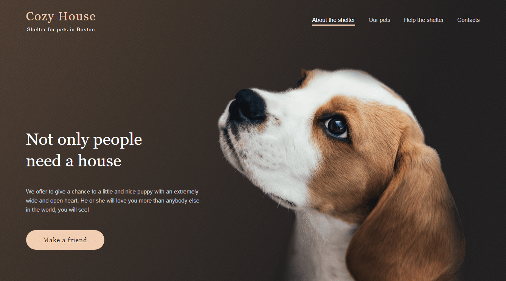

# Shelter Website Project

## Overview



Shelter is a comprehensive project designed to develop a website consisting of two pages. The goal is to create a site that is both adaptive and interactive, displaying proficiency in web development techniques including semantic HTML, maintainable CSS, and interactive JavaScript functionalities.

***************************

## Deploy ##

* [https://massaracsh7.github.io/shelter/index.html](https://massaracsh7.github.io/shelter/index.html)

***************************

## Key Features

- **Semantic and Adaptive Layout**: The website uses valid and semantic HTML5 tags and is designed to be fully responsive on all devices.
- **Exporting Styles and Graphics from Figma**: Graphics and design elements were converted from Figma assets to ensure visual consistency with the original design.
- **Interactive Elements**:
  - Burger Menu: Implemented for device widths less than 768px for improved mobile navigation.
  - Infinite Slider Carousel: Located on the Main page, providing a dynamic way to showcase featured pets.
  - Pagination: Available on the Pets page to efficiently navigate through lists of pets.
  - Pop-up Modal: This feature is used to display detailed information about each pet on both the Main and Pets pages.

## Project Structure

- **Main Page**
  - Header: Includes navigation and branding.
  - Not only: Highlights unique aspects of the shelter.
  - About: Provides information about the shelter's mission and history.
  - Our Friends: Introduces some of the pets available for adoption.
  - Help: Details on how visitors can contribute or volunteer.
  - In Addition: Additional information about shelter services.
  - Footer: Contact information and additional links.
- **Pets Page**
  - Header: Consistent with the Main page for a unified look.
  - Our Friends: Displays the pets in a paginated format.
  - Footer: Similar to the Main page to maintain consistency.

## Technologies Used

- HTML5
- CSS3 / SASS
- JavaScript
- Webpack for bundling
- Babel for JavaScript transpilation
- npm for dependency management
- `gh-pages` for deployment

## Setup and Installation

To get this project up and running on your local machine, follow these steps:

1. **Clone the repository:**

   ```bash
   git clone https://github.com/massaracsh7/shelter.git
   cd shelter

2. **Install dependencies:**

   ```bash
   npm install
   
3. **Running the development server:**

   ```bash
   npm run dev
   
   This will open up a local server at http://localhost:8080/main/index.html where you can see your changes as you develop.

4. **Building for production:**

   ```bash
   npm run build

   This command prepares the dist directory with your bundled application ready for deployment.

5. **Deploying to GitHub Pages:**

   ```bash
   npm run deploy
  
  This will update the gh-pages branch of your repository with the contents of the dist directory, making your project live on GitHub Pages.